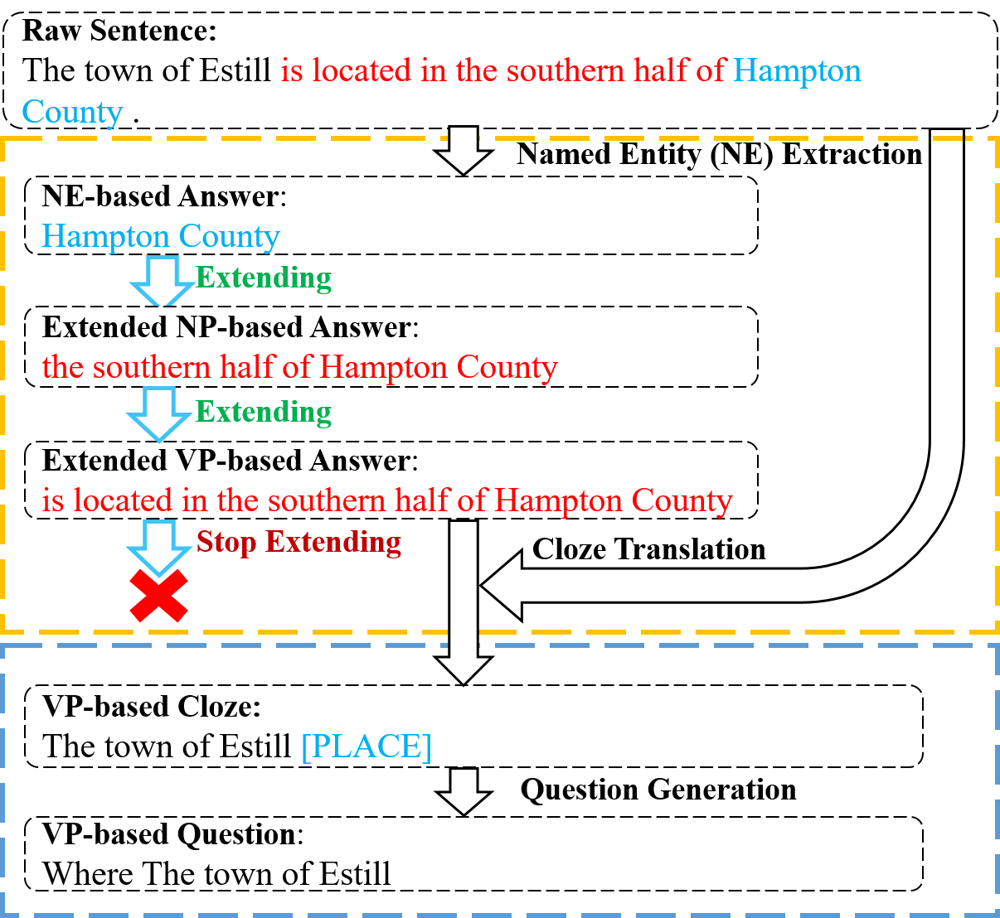
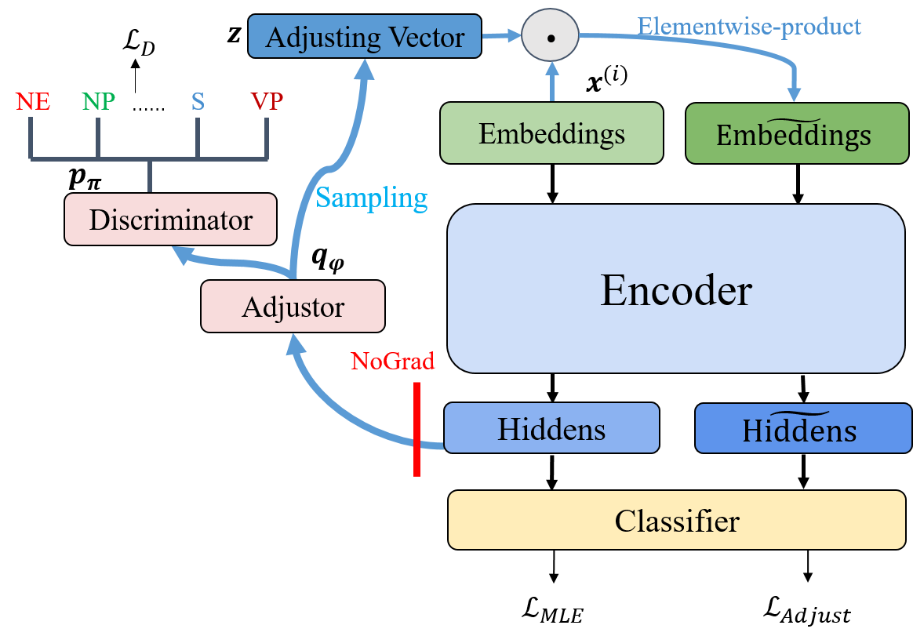
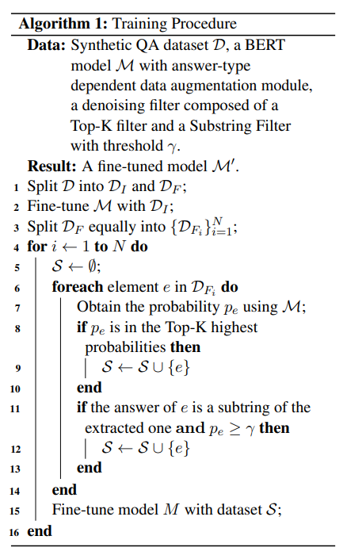

# DiverseQA

This repository contains code and data for the paper: [Unsupervised Question Answering via Answer Diversifying (COLING 2022)](https://aclanthology.org/2022.coling-1.149/).

- We propose **DiverseQA**, an unsupervised question answering method via answer diversification.

- Experiments on  SQuADv1.1, NewsQA, TriviaQA, BioASQ, and DuoRC demonstrate the effectiveness of our method.

## Introduction
The proposed method (DiverseQA) is composed of three modules: data construction, data augmentation and denoising filter. Firstly, the data construction module extends the extracted named entity into a longer sentence constituent as the new answer span to construct a QA dataset with diverse answers. Secondly, the data augmentation module adopts an answer-type dependent data augmentation process via adversarial training in the embedding level. Thirdly, the denoising filter module is designed to alleviate the noise in the constructed data.


<p align="center">

</p>

<p align="center">

</p>

<p align="center">

</p>


## Requirements
- Python 3.6.13
- benepar 0.2.0
- spacy 3.2.4
- numpy 1.19.5
- tensorboardX 2.4.1
- torch 1.8.1
- transformers 4.5.1
- pytoch_transformers 1.2.0
- nltk 3.5
- tqdm 4.62.3

## Data Preparation
Make the following data directories:  
```bash
mkdir -p ./data/diverse_data
````

Acquire `wikiref.json` [here](https://drive.google.com/open?id=18o8EjlCcimvuF0HYe8sHSu6epTqDwvp_). Specifically, unzip the zip file and move `wikiref.json` into `/data/diverse_data`. This is the raw data provided in [RefQA](https://github.com/Neutralzz/RefQA).

Construct QA data with diverse answers:
```bash
python wikiref_process.py --span_type NE
python wikiref_process.py --span_type NP
python wikiref_process.py --span_type ADJP
python wikiref_process.py --span_type VP
python wikiref_process.py --span_type S
python extend_ans_types.py
python cloze2natural.py
python dataset_partition.py
```
You can also used the constructed dataset [here](https://drive.google.com/drive/folders/1nNd5x3mCqIJiDSov-iE03y6Jx4r9mvRP) without running the above scripts.
Besides, please also download the [dev](https://github.com/rajpurkar/SQuAD-explorer/blob/master/dataset/dev-v1.1.json) set of SQuAD and move it to `./data` folder.

Train a QA model with answer-type dependent data augmentation (`run_squad.py`) and denoising filter (`multi_turn.py`) on the constructed QA instances and evaluate the trained model on SQuAD-v1.1 dev set:

Firstly, initialize a QA model with parts of the dataset:
```bash
./run_main.sh
```
We use SQuAD-v1.1 dev set to evaluate each checkpoint, and find the best checkpoint is `./output_main/checkpoint-2000`. 
Then, we copy necessary files into the folder:
```bash
cp ./output_main/added_tokens.json ./output_main/checkpoint-2000/
cp ./output_main/predictions_2000.json ./output_main/checkpoint-2000/predictions_.json
cp ./output_main/special_tokens_map.json ./output_main/checkpoint-2000/
cp ./output_main/tokenizer_config.json ./output_main/checkpoint-2000/
cp ./output_main/vocab.txt ./output_main/checkpoint-2000/
```

After that, we execute the following script to obtain the final model:
```bash
./run_filter.sh
```

NOTE:
1. We use three 3090Ti (24 GB) GPUs to train the QA model and obtain the results. However, different types of machines will produce slightly different results even if we use the same training setting. Yet, the conclusion in this paper still hold.
2. Because of some unexpected causes of our server, I cannot access the scripts of model evaluation on TriviaQA, NaturalQuestion, NewsQA, BioASQ and DuoRC. Therefore, these scripts are unavailable at present. Despite of that, I will upload them as long as I can log into the server. :)


## Acknowledgement
Some of the codes are constructed based on the [RefQA](https://github.com/Neutralzz/RefQA) repository and [BERT](https://github.com/google-research/bert) repository. Huge thanks to the contributors of the amazing repositories!

## Reference
Please cite the paper in the following format if you use our model or dataset during your research.

```bibtex
@inproceedings{nie-etal-2022-unsupervised,
    title = "Unsupervised Question Answering via Answer Diversifying",
    author = "Nie, Yuxiang  and
      Huang, Heyan  and
      Chi, Zewen  and
      Mao, Xian-Ling",
    booktitle = "Proceedings of the 29th International Conference on Computational Linguistics",
    month = oct,
    year = "2022",
    address = "Gyeongju, Republic of Korea",
    publisher = "International Committee on Computational Linguistics",
    url = "https://aclanthology.org/2022.coling-1.149",
    pages = "1732--1742",
}
```

## Q&A
If you encounter any problem, feel free to either directly contact the [first author](mailto:jerrrynie@gmail.com) or leave an issue in the Github repo.